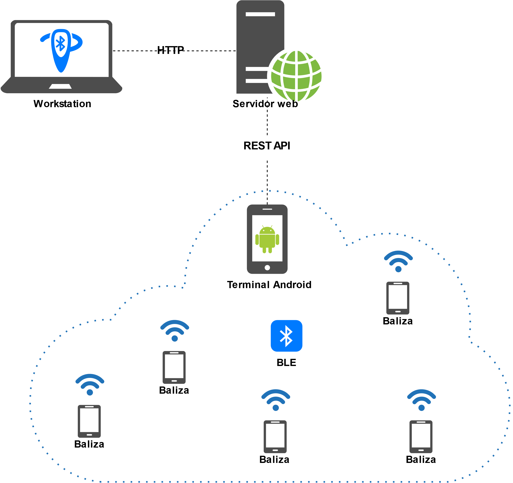
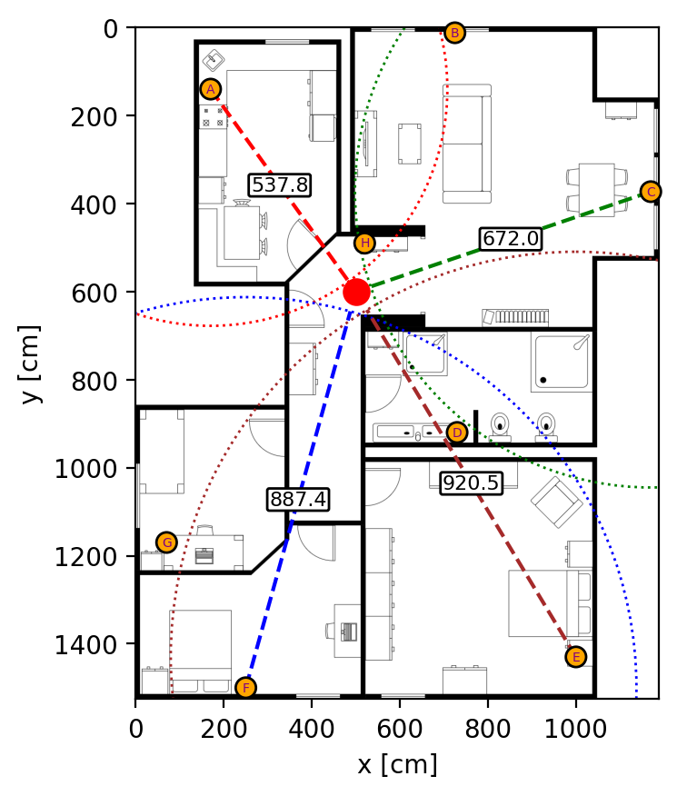

# Web backend for an indoor positioning system based on Bluetooth Low Energy

## Description

This repository houses the code of the backend logic of a web-based indoor positioning service as described by following Master Thesis: https://openaccess.uoc.edu/handle/10609/150532?locale=en.

The Master Thesis showcases the development of a prototype for an indoor positioning system using state-of-the-art techniques and BLE as RF technology.



The Master Thesis is already submitted and finalized. Contributions are welcome.

## Table of Contents

- [Requirements](#requirements)
- [Setup for development](#setup-for-development)
- [Backend setup](#backend-setup)
- [Overview](#overview)

## Requirements

- Python 3.11 ([_pyenv_](https://github.com/pyenv/pyenv) is recommended to handle multiple Python versions)
- [_Pipenv_](https://pipenv.pypa.io/en/latest/) as virtual environment management tool.
- [_Docker_](https://www.docker.com/) to deploy the database and optionally the backend as well.

## Setup for development

1. Install _pipenv_:
    ```console
    $ python -m pip install pipenv
    ```
2. Create/activate the virtual environment for the project:
    ```console
    $ pipenv shell
    ```
3. Install all the dependencies:
    ```console
    $ pipenv install --dev
    ```

To migrate the database schema:
```console
$ alembic upgrade head
```

## Backend setup

1. Build the containers:
    ```console
    $ docker compose -f docker/docker-compose.yaml build
    ```
2. Start the containers:
    ```console
    $ docker compose -f docker/docker-compose.yaml up -d 
    ```
3. Check that the different endpoints are working: http://localhost:9999/docs

To stop the containers:
```console
$ docker compose -f docker/docker-compose.yaml down
```

## Overview

_work in progress_




